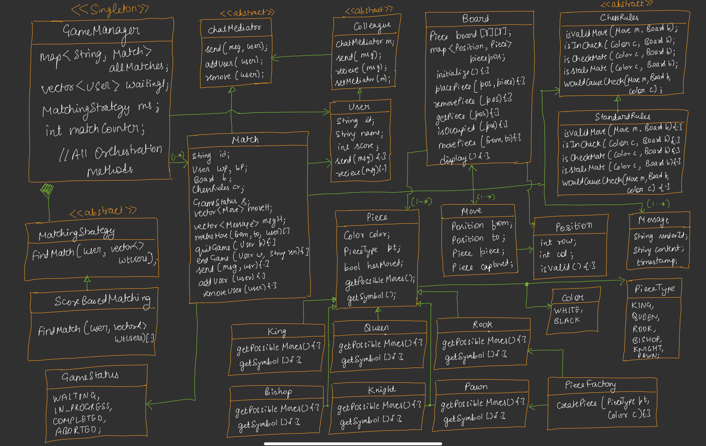

# ChessGame-LLD-Project

## Overview
The ChessGame-LLD-Project is a Java-based implementation of a chess game system designed using various object-oriented design patterns. This project serves as a low-level design (LLD) exercise, showcasing how to structure a complex system with modularity, extensibility, and maintainability in mind. It includes a fully functional chess board, piece movement logic, game rules, match management, and a chat system for players.


## Features
- **Chess Board**: An 8x8 grid with pieces placed according to standard chess starting positions.
- **Piece Movement**: Implements movement rules for King, Queen, Rook, Bishop, Knight, and Pawn using the Strategy Pattern.
- **Game Rules**: Supports standard chess rules including valid moves, check, checkmate, and stalemate detection via the Strategy Pattern.
- **Match Management**: Uses the Singleton and Mediator Patterns to manage active matches and player interactions.
- **Player Matching**: Employs a Strategy Pattern for score-based matching of players.
- **Chat System**: Implements a Mediator Pattern for in-game communication between players.
- **Demo**: Includes a demonstration of Scholar's Mate (a 4-move checkmate) and basic game manager functionality.

## Design Patterns Used
- **Strategy Pattern**: Defines piece movement and game rules as interchangeable strategies (e.g., `ChessRules`, `getPossibleMoves`).
- **Factory Pattern**: Creates chess pieces dynamically using `PieceFactory`.
- **Mediator Pattern**: Manages communication between players via `Match` as a mediator.
- **Singleton Pattern**: Ensures a single `GameManager` instance for managing matches.

## Project Structure
- **enums**: Defines `Color`, `PieceType`, and `GameStatus` for type safety.
- **models**: Contains core classes like `Position` and `Move`.
- **factory**: Houses `PieceFactory` for piece creation.
- **rules**: Implements `ChessRules` and `StandardChessRules` for game logic.
- **mediator**: Contains `ChatMediator`, `Colleague`, `Message`, and `User` for communication.
- **strategy**: Includes `MatchingStrategy` and `ScoreBasedMatching` for player pairing.
- **manager**: Features `GameManager` as a singleton for match oversight.

- **Chess.java**: Main entry point for running the system.


### Example Output
```
=== Scholar's Mate Demo (4-move checkmate) ===
Match started between Aditya (White) and Rohit (Black)
[Board display with initial setup]

Move 1: White e2-e4
[Move executed, board updated]

Move 4: White Qh5xf7# (Checkmate!)
Game ended - Aditya wins by checkmate!
Score update: Aditya +30, Rohit -20
```

## Benefits
- **Modularity**: Each component (board, rules, match) is independently manageable.
- **Extensibility**: New piece types, rules, or matching strategies can be added with minimal changes.
- **Scalability**: The design supports multiple simultaneous matches and player interactions.
- **Maintainability**: Clear separation of concerns enhances code readability and debugging.

## Limitations
- **Performance**: Recursive move validation and board state checks may impact performance in large-scale scenarios.
- **Incomplete Features**: Lacks full GUI, AI opponents, or save/load functionality.
- **Error Handling**: Basic error checking; advanced validation (e.g., en passant, castling) needs refinement.

## Getting Started
1. Clone or copy the project files into your workspace.
2. Ensure Java Development Kit (JDK) is installed.
3. Compile all `.java` files in the respective folders.
4. Run `Chess.java` to start the demo.
